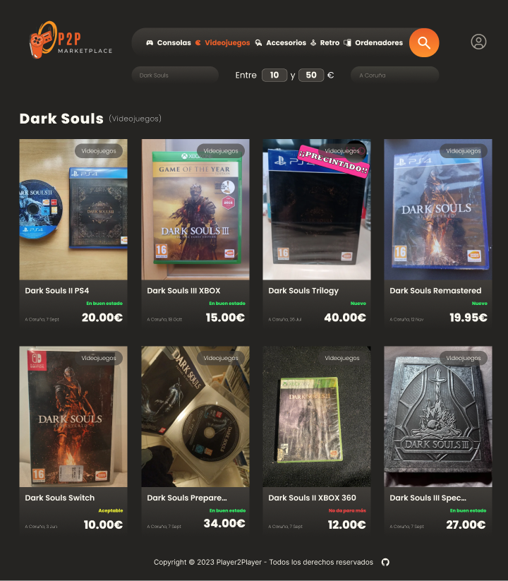
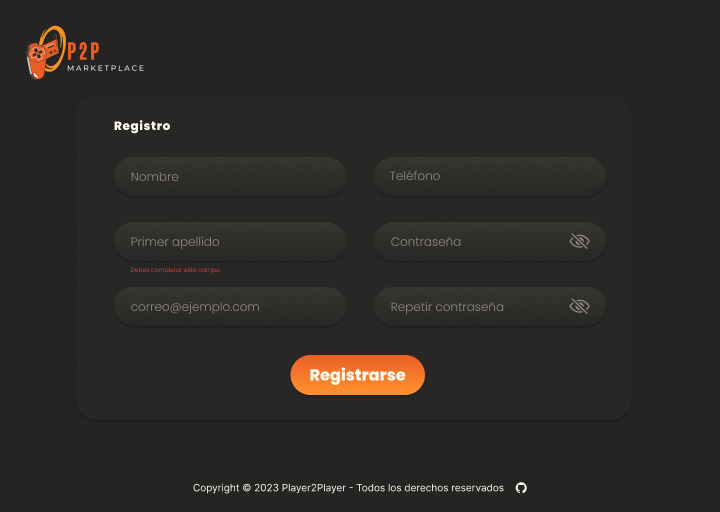
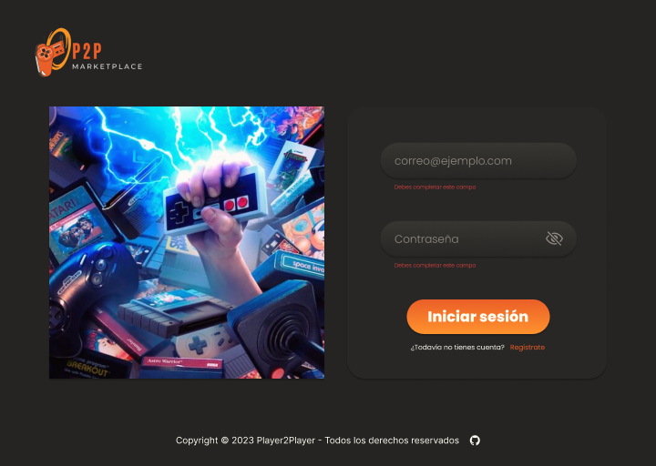
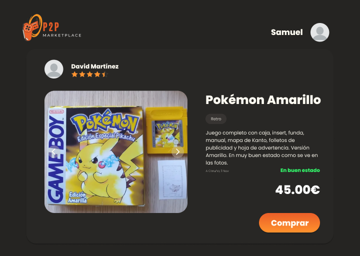

   # **P2P - Player2Player**
   
   ## **Descripción del Proyecto:**
   "P2P - Player2Player" es una plataforma en línea diseñada para la compra y venta de videojuegos, consolas y PCs de segunda mano. La plataforma permite a los usuarios buscar productos, registrarse para obtener acceso completo, publicar sus propios productos y llevar a cabo transacciones seguras. El proyecto consta de un frontend interactivo y un backend robusto.
   
   A continuación se describen las principales funcionalidades del proyecto con las respectivas imágenes del wireframe empezando por la pantalla de inicio.

## **Funcionalidades para Usuarios Anónimos:**

1. **Búsqueda de productos:**
   - Los usuarios anónimos pueden buscar explorar productos y buscar productos utilizando varios criterios, como nombre, categoría, localidad y precio, para encontrar productos de su interés.

1. **Autenticación:**
   - Los usuarios pueden registrarse para obtener una cuenta en la plataforma.
   - Se envía un correo electrónico de confirmación con un código para activar la cuenta antes de permitir el inicio de sesión.

  - Una vez la cuenta ha sido activada, los usuarios pueden iniciar sesión y acceder a todos los servicios de la plataforma.
  

## **Funcionalidades para Usuarios Registrados:**

1. **Gestión del Perfil:**
   - Los usuarios registrados tienen la capacidad de gestionar su perfil, lo que incluye la modificación de sus datos de registro, y la posibilidad de agregar una biografía y una foto de perfil personalizada.

1. **Publicación de Nuevos productos:**
   - Los usuarios registrados pueden publicar sus propios productos en la plataforma, proporcionando información detallada, como nombre, imagen, descripción, categoría, precio y localidad de venta.

1. **Proceso de Reserva de productos:**
   - Cuando un comprador está interesado en un artículo, puede realizar una propuesta de compra al vendedor a través de la plataforma.

   - El vendedor recibe la propuesta de compra por correo electrónico y tiene la opción de aceptarla o rechazarla. 

   - Una vez aceptada la propuesta de compra, el vendedor selecciona un lugar y hora para la entrega.

   - El comprador recibe una notificación por correo electrónico si la compra es aceptada, incluyendo detalles de la hora y lugar de entrega.

1. **Valoraciones:**
   - Después de la entrega exitosa de un artículo, el comprador tiene la opción de valorar al vendedor en la plataforma, proporcionando retroalimentación y una calificación.

## **Funcionalidades del Backend:**

1. **Base de Datos:**
   - Se crea una base de datos para almacenar información sobre usuarios, productos, pedidos y valoraciones.

2. **Servidor Express:**
   - Se utiliza Express para crear el servidor de la aplicación, gestionando solicitudes y respuestas HTTP.

3. **Conexión con la Base de Datos:**
   - Se establece una conexión segura entre el servidor Node.js y la base de datos para almacenar y recuperar datos de manera eficiente.

4. **Middlewares:**
   - Se implementa un middleware que se encarga de autentificar al usuario que intenta hacer uso de las funcionalidades de la plataforma que requieren autenticación.

5. **Helpers:**
   - Se crean funciones auxiliares que se encargan de realizar tareas de manejo de imágenes, validaciones y gestión de errores.

6. **Endpoints API:**
   - Se crean endpoints API para las siguientes funciones:
     - Registro e inicio de sesión de usuarios.
     - Listado de productos, incluyendo información del vendedor y valoración media de éste.
     - Visualización detallada de un artículo, con información y valoración media del vendedor.
     - Filtros avanzados para la búsqueda de productos por nombre, categoría, localidad y precio.
     - Creación de nuevos productos.
     - Actualización de perfiles de usuarios.
     - Propuestas de compra y confirmación de compras.
     - Valoraciones de vendedores por parte de los compradores.

7. **Documentación:**
   - Se crea una documentación detallada en un archivo README.md, que incluye una descripción de la aplicación, instrucciones paso a paso para ejecutar el proyecto y un listado completo de los endpoints API disponibles.

## **Notas Adicionales:**
   - Se implementa validación de datos en todos los endpoints utilizando Joi para garantizar la integridad de la información en la base de datos.
   - Se establecen medidas de seguridad sólidas para proteger la información de los usuarios mediante el uso de JWT (JSON Web Token) y bcrypt.
  
